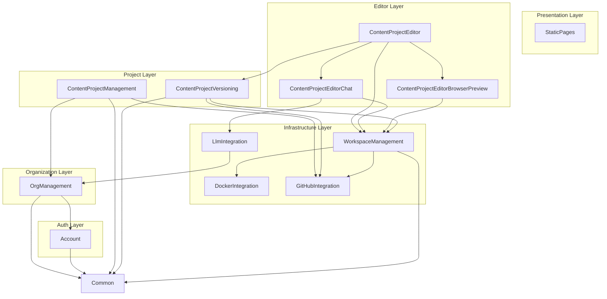

# Feature Vertical Responsibilities and Capabilities

This document defines the internal responsibilities and external capabilities (Facade API) for each feature vertical in the SiteBuilder application, following the ETFS architecture pattern from [archbook.md](../etfs-app-starter-kit/docs/archbook.md).

## Vertical List (13 total)

1. Common
2. StaticPages
3. Account
4. OrgManagement
5. ContentProjectManagement
6. ContentProjectVersioning
7. ContentProjectEditor
8. ContentProjectEditorChat
9. ContentProjectEditorBrowserPreview
10. WorkspaceManagement
11. DockerIntegration
12. GitHubIntegration
13. LlmIntegration

---

## Common

**Responsibilities:**
- Cross-cutting utilities (DateAndTimeService, validation helpers)
- Shared DTOs and value objects used across multiple verticals
- Base infrastructure concerns (logging utilities, exception base classes)
- Shared Twig macros and UI components

**Capabilities (Facade):**
- `DateAndTimeService` for consistent date/time handling
- Common validation utilities
- Shared value objects (e.g., `EmailAddress`, `Uuid`)

---

## StaticPages

**Responsibilities:**
- SiteBuilder application's own static content pages
- Public marketing pages (home/landing page)
- Help documentation and FAQ pages
- Legal pages (terms, privacy policy, imprint)
- About/contact pages

**Capabilities (Facade):**
- Generally no Facade needed - this vertical is mostly Presentation-only
- Other verticals don't typically depend on static pages

---

## Account

**Responsibilities:**
- User registration (sign up)
- Authentication (sign in, sign out)
- Password reset flow and token handling
- Email verification
- Session management
- User profile management (name, email, avatar)

**Capabilities (Facade):**
- `getCurrentUser(): UserDto`
- `getUserById(userId): UserDto`
- `isAuthenticated(): bool`
- `validateUserExists(userId): void` - throws if not found

---

## OrgManagement

**Responsibilities:**
- Organization CRUD operations and persistence
- Team management within organizations
- Member invitations and invitation token handling
- Team-member association management
- BYOK key storage and encryption (GitHub tokens, LLM API keys)
- Organization-level settings and preferences

**Capabilities (Facade):**
- `getOrganization(organizationId): OrganizationDto`
- `getUserOrganizations(userId): OrganizationDto[]`
- `isUserMemberOfOrganization(userId, organizationId): bool`
- `getOrganizationApiKeys(organizationId): ApiKeysDto` - returns decrypted keys for runtime use
- `getOrganizationGitHubToken(organizationId): string`
- `getOrganizationLlmApiKey(organizationId): string`
- `validateOrganizationAccess(userId, organizationId): void` - throws if unauthorized

---

## ContentProjectManagement

**Responsibilities:**
- Content project CRUD operations and metadata persistence
- Project-organization ownership associations
- Project-team access permissions
- GitHub repository creation coordination (delegates to GitHubIntegration)
- Project listing, filtering, and search

**Capabilities (Facade):**
- `createContentProject(organizationId, name): ContentProjectDto`
- `getContentProject(projectId): ContentProjectDto`
- `listContentProjects(organizationId): ContentProjectDto[]`
- `canUserAccessProject(userId, projectId): bool`
- `deleteContentProject(projectId): void`
- `getProjectGitHubUrl(projectId): string`

---

## ContentProjectVersioning

**Responsibilities:**
- Version/commit metadata storage in database
- Rollback operations and history navigation
- Mapping between database version records and git commits
- Change summaries and diff generation
- Coordinates with GitHubIntegration for actual git operations

**Capabilities (Facade):**
- `createVersion(projectId, message): VersionDto` - commits current workspace state
- `getVersionHistory(projectId): VersionDto[]`
- `getVersion(versionId): VersionDto`
- `rollbackToVersion(projectId, versionId): void`
- `getCurrentVersion(projectId): VersionDto`
- `getVersionDiff(versionId): DiffDto`

---

## ContentProjectEditor

**Responsibilities:**
- Editor session orchestration and lifecycle
- Coordinating between Chat, Preview, and Versioning verticals
- Editor UI presentation layer (Twig templates, Stimulus controllers)
- Session state management (current project, active workspace)
- Export functionality (ZIP generation from build output)

**Capabilities (Facade):**
- `startEditorSession(projectId, userId): EditorSessionDto`
- `getEditorSession(sessionId): EditorSessionDto`
- `endEditorSession(sessionId): void`
- `exportProject(projectId): ExportResultDto` - returns ZIP download info

---

## ContentProjectEditorChat

**Responsibilities:**
- Chat UI rendering and user message handling
- Chat message persistence and history
- Message routing to LLM integration
- Response streaming to the UI via SSE/WebSocket
- Chat session management within editor sessions

**Capabilities (Facade):**
- `sendMessage(sessionId, userMessage): void` - initiates async LLM response
- `getChatHistory(sessionId): ChatMessageDto[]`
- `streamResponse(sessionId): StreamHandle` - for SSE/streaming response
- `clearChatHistory(sessionId): void`

---

## ContentProjectEditorBrowserPreview

**Responsibilities:**
- Preview iframe/embed rendering
- Build output retrieval from workspace
- Preview refresh triggering after changes
- Preview viewport size management (responsive testing)
- Serving preview content to the embedded browser

**Capabilities (Facade):**
- `getPreviewUrl(projectId): string`
- `refreshPreview(projectId): void`
- `getPreviewContent(projectId, path): string` - serves built assets
- `triggerBuild(projectId): BuildResultDto`

---

## WorkspaceManagement

**Responsibilities:**
- Workspace session lifecycle (create, destroy, timeout handling)
- File system operations within workspace boundaries
- Build command execution orchestration
- Workspace isolation and cleanup
- Mapping workspaces to Docker containers

**Capabilities (Facade):**
- `createWorkspace(projectId): WorkspaceDto`
- `destroyWorkspace(workspaceId): void`
- `executeCommand(workspaceId, command): CommandResultDto`
- `readFile(workspaceId, path): string`
- `writeFile(workspaceId, path, content): void`
- `listFiles(workspaceId, path): FileListDto`
- `getWorkspaceForProject(projectId): WorkspaceDto`

---

## DockerIntegration

**Responsibilities:**
- Container lifecycle management (create, start, stop, destroy)
- Container image management (pulling `landingpages-ai-template` image)
- Container networking configuration
- Resource quotas and limits enforcement
- Container health monitoring and automatic cleanup
- Ephemeral container security boundaries

**Capabilities (Facade):**
- `createContainer(config): ContainerDto`
- `startContainer(containerId): void`
- `stopContainer(containerId): void`
- `destroyContainer(containerId): void`
- `executeInContainer(containerId, command, timeout): ExecutionResultDto`
- `streamContainerOutput(containerId): StreamHandle`
- `getContainerStatus(containerId): ContainerStatusDto`

---

## GitHubIntegration

**Responsibilities:**
- GitHub API communication
- Repository creation from template (landingpages-ai-template)
- Git clone/pull operations into workspaces
- Git commit and push operations
- Repository access validation
- BYOK GitHub token handling

**Capabilities (Facade):**
- `createRepositoryFromTemplate(token, orgName, repoName): RepositoryDto`
- `cloneRepository(token, repoUrl, targetPath): void`
- `commitAndPush(token, repoPath, message): CommitDto`
- `getCommitHistory(token, repoUrl): CommitDto[]`
- `checkoutCommit(repoPath, commitSha): void`
- `validateToken(token): bool`

---

## LlmIntegration

**Responsibilities:**
- LLM API communication (OpenAI, Anthropic, etc.)
- Tool/function calling definition and execution
- Streaming response handling and parsing
- BYOK key injection at runtime (never persisted in container)
- Rate limiting, retry logic, and error handling
- System prompt management and injection

**Capabilities (Facade):**
- `sendPrompt(apiKey, messages, tools): LlmResponseDto`
- `streamPrompt(apiKey, messages, tools): StreamHandle`
- `getAvailableTools(): ToolDefinitionDto[]`
- `executeToolCall(workspaceId, toolCall): ToolResultDto`

---

## Vertical Dependency Diagram

---

## Key Design Principles

1. **Facade-only cross-vertical communication**: All arrows in the diagram represent Facade interface dependencies, never internal layer access.

2. **Layered abstraction**: 
   - DockerIntegration and GitHubIntegration are the lowest level (raw external service ops)
   - WorkspaceManagement wraps Docker/GitHub with project-aware semantics
   - Editor verticals orchestrate workspace operations for user-facing features

3. **API key flow**: OrgManagement stores encrypted keys; LlmIntegration and GitHubIntegration receive them at runtime via their Facades and use them for API calls without persistence.

4. **Single responsibility**: Each vertical has a clear, bounded purpose - e.g., ContentProjectEditorChat handles chat UI/history but delegates actual LLM communication to LlmIntegration.

5. **Git operations split**: GitHubIntegration handles raw git/GitHub API operations; ContentProjectVersioning provides the business layer (version metadata, rollback logic, history UI).
